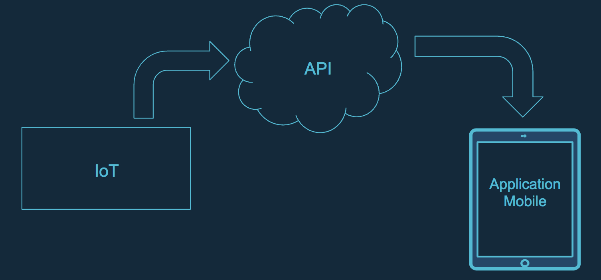
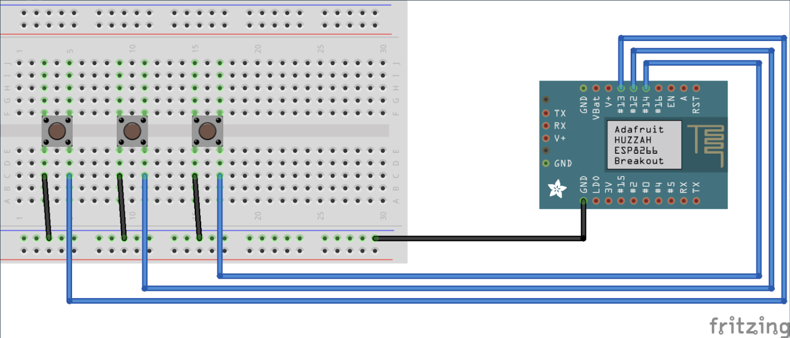

# Satisfy_IoT
Le projet Satisfy est un projet développé dans le cadre de la semaine thématique "Securité IoT" (du 16 au 20 Avril 2018)

Le projet est le développement d'une borne de satisfaction à mettre à disposition de clients.

## Le Projet
Le projet se découpe en 3 parties : 
- Une API : https://github.com/Darkkrye/Satisfy_API,
- IoT : ce repository,
- Une application mobile : https://github.com/Darkkrye/Satisfy_iOS

## Git
Ce repository contient la partie code IoT du projet développé

## Architecture
L'architecture utilisée est simple et représentée par le schéma ci-dessous :
Inline-style: 

## Fritzing
Les branchements effectués sur le projets sont représentés par le schéma ci-dessous :
Inline-style: 
